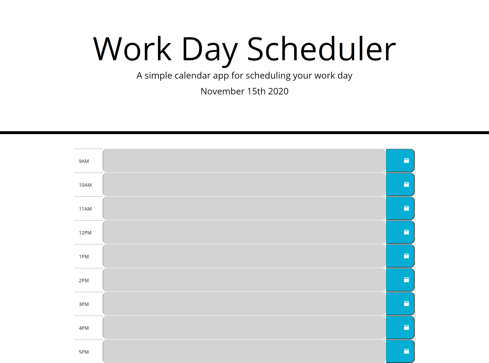

# Work Day Scheduler Starter Code

# Purpose 

This is a daily-calendar that starts at 9:00a.m. and goes until 5:00p.m.. Users can plan out their day by the hour. It it is color coded to help the User know if they are past a certain time, coming up on a deadline, and that they are in the clear.

# Contents

<ul>
    <li><a href="#built-with">Built With</a></li>
    <li><a href="#features">Features</a></li>
    <li><a href="#website">Website</a></li>
    <li><a href="contributions">Contributions</a></li>
</ul>

# Built With

<ul id="built-with">
    <li>HTML</li>
    <li>CSS/Bootstrap</li>
    <li>JavaScript/JQuery</li>
</ul>

# Features

<ul id="features">
    <li>An hour by hour calendar</li>
    <li>Color coded to let user know if task is in Future, Past, or Present.</li>
    <li>Updates every so often so user doesnt have to refresh manually all the time</li>
</ul>

# Website

<a href="https://dmorrel7.github.io/Daily-Calendar/">Daily-Calendar</a>

# Contributions

<ul id="contributions">
    <li>MomentJs</li>
    <li>The website StackOverflow</li>
    <li>JQuery website</li>
    <li>Bootstrap website</li>
